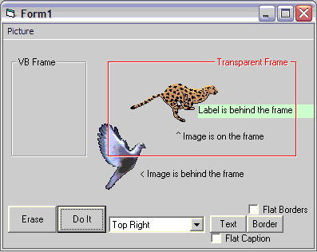



## FYI: Transparent Frame \(Imitation\)

### Description

With a little trickery and subclassing, we can make a picture box look and feel as if it was a transparent frame. For XP manifest lovers, I know how much frames are a pain; this could be a nice substitute. This project isn't overly commented, but it isn't very big either. Uses Paul Caton's excellent subclassing thunks. 27Jan05: Didn't refresh when frame size reduced by code. 28Jan05: Modified to allow a no border option.
 
### More Info
 

             |
---                |---
**Submitted On**   |2007-01-28 12:00:30
**By**             |[LaVolpe](https://github.com/Planet-Source-Code/PSCIndex/blob/master/ByAuthor/lavolpe.md)
**Level**          |Intermediate
**User Rating**    |5.0 (30 globes from 6 users)
**Compatibility**  |VB 6\.0
**Category**       |[Graphics](https://github.com/Planet-Source-Code/PSCIndex/blob/master/ByCategory/graphics__1-46.md)
**World**          |[Visual Basic](https://github.com/Planet-Source-Code/PSCIndex/blob/master/ByWorld/visual-basic.md)
**Archive File**   |[FYI\_\_Trans2045151282007\.zip](https://github.com/Planet-Source-Code/lavolpe-fyi-transparent-frame-imitation__1-67715/archive/master.zip)

